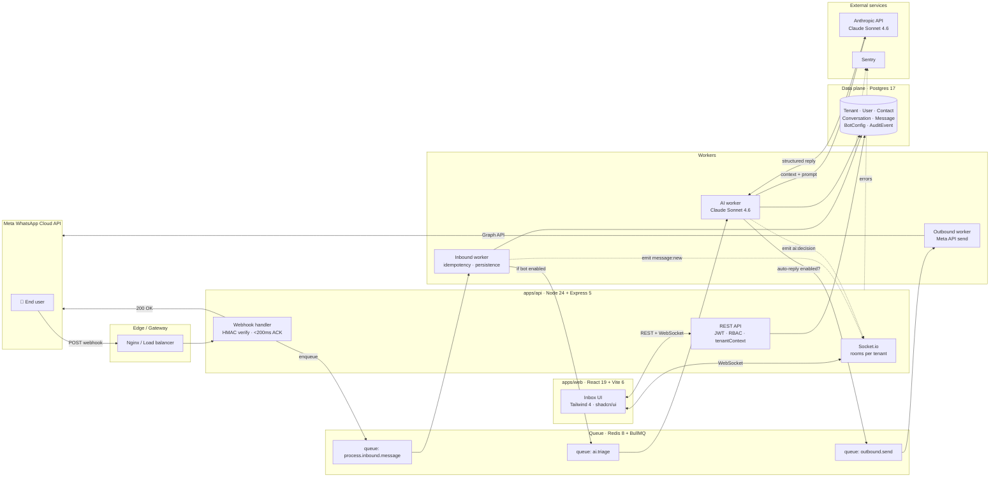

# Orion

> **Multi-tenant conversational CRM platform for WhatsApp Cloud API.**
> AI-native, omnichannel-ready, built for B2B SaaS.

[]()
[]()
[]()
[]()
[]()

---

## What is Orion?

Orion is a SaaS B2B platform where each tenant (client company) connects their
own **WhatsApp Business Cloud API** number, manages a team of human operators
with balanced workload, and delegates first-line triage, intent classification,
and lead scoring to an **AI agent (Claude)**. Conversations flow seamlessly
between bot and human with preserved context, and a built-in analytics layer
exposes conversion, response times, attention quality, and ROI.

The differentiator is the AI: it is not a decorative chatbot. It is a
commercial strategist that understands each tenant's business through their
`BotConfig`, catalog, conversation history, and KPIs. Every reply is sourced
from real tenant context, never from generic templates.

The platform is built on a hexagonal, domain-driven architecture with strict
multi-tenant isolation enforced at every query and verified by dedicated
isolation tests. Engineering discipline (Conventional Commits, trunk-based
development, mandatory tests, ADR-backed decisions) is part of the contract.

---

## Architecture at a glance



The full data flow is documented in `docs/flows/` (one Mermaid diagram per
critical flow, populated starting Sprint 3).

---

## Project status

| Sprint | Description | Status |
| ------ | ----------- | ------ |
| **S0** | Preflight — toolchain check, monorepo skeleton | ✅ Complete |
| **S1** | Foundations — README, schema.prisma, folder structure, typed env, ADRs | 🟡 In progress |
| S2 | Backend core — Express, Zod env, Prisma, health checks, logger | ⏳ Pending |
| S3 | Webhooks + BullMQ — Meta webhook, HMAC, idempotency | ⏳ Pending |
| S4 | Identity & multi-tenant — auth, JWT, RBAC, invites | ⏳ Pending |
| S5 | AI Orchestration — Claude integration, BotConfig, triage | ⏳ Pending |
| S6 | Frontend Inbox — login, conversation list, send messages | ⏳ Pending |
| S7 | Real-time — Socket.io with Redis adapter | ⏳ Pending |
| S8 | Hardening — rate limiting, Sentry, metrics, audit log | ⏳ Pending |
| S9 | Deploy — Docker, CI/CD, DigitalOcean | ⏳ Pending |

---

## Tech stack

Versions reflect the project's **latest-stable policy** ([ADR-0004](./docs/adr/0004-latest-stable-versioning-policy.md)).

### Backend (`apps/api`)
- **Runtime:** Node.js 24 LTS · TypeScript 5.7+ (strict mode)
- **HTTP:** Express 5 · Helmet · compression
- **ORM:** Prisma 6 · PostgreSQL 17
- **Cache / Queue / Pub-Sub:** Redis 8 (or Valkey) · BullMQ 5
- **Validation:** Zod 4
- **Auth:** JWT (access 15 min) + refresh rotation · Argon2id passwords · blacklist in Redis
- **Logging:** Pino 9 (structured JSON, redacted PII)
- **Tests:** Vitest 3 · Supertest · Testcontainers
- **AI:** Anthropic SDK · Claude Sonnet 4.6 (default) · Haiku 4.5 (optimisation)

### Frontend (`apps/web`)
- **Core:** React 19 + Vite 6 + TypeScript 5.7
- **State:** Zustand (client) + TanStack Query (server)
- **Styling:** Tailwind 4 + shadcn/ui (Radix primitives)
- **Forms:** React Hook Form + Zod resolver
- **Real-time:** socket.io-client 4
- **Icons:** Lucide React

### Tooling
- **Monorepo:** pnpm workspaces + Turborepo 2
- **Linter / Formatter:** Biome 2 (single tool, see [ADR-0003](./docs/adr/0003-biome-over-eslint-prettier.md))
- **Git hooks:** Husky + lint-staged + commitlint
- **Tests E2E:** Playwright

### Infrastructure
- **Containers:** Docker · docker-compose (local dev)
- **Hosting API:** DigitalOcean Droplet (Linux)
- **Hosting DB:** DigitalOcean Managed Postgres
- **Hosting Cache:** DigitalOcean Managed Redis
- **Hosting Web:** Vercel (Hobby tier)
- **CI/CD:** GitHub Actions (workflows in `.github/workflows/`)
- **Observability:** Sentry (errors) · Grafana Cloud (metrics + logs)

---

## Repository layout

```
orion/
├─ apps/
│  ├─ api/                   # Express backend (S2+)
│  │  ├─ prisma/
│  │  │  └─ schema.prisma    # ✅ Multi-tenant schema (S1)
│  │  └─ src/                # Express app (populated S2+)
│  └─ web/                   # React + Vite frontend (S6+)
├─ packages/
│  └─ shared/                # ✅ Types, Zod schemas, env validation (S1)
│     ├─ src/
│     │  ├─ env.ts           # Zod 4 env loader (fail-fast)
│     │  └─ index.ts         # Public barrel
│     └─ README.md
├─ docs/
│  ├─ adr/                   # ✅ Architecture Decision Records (5 adopted)
│  └─ flows/                 # Mermaid diagrams per critical flow (S3+)
├─ ops/
│  ├─ docker/                # Dockerfiles + docker-compose (S2 + S9)
│  └─ grafana/dashboards/    # Observability dashboards (S8)
├─ .github/
│  └─ workflows/             # CI/CD (S9)
├─ .env.example              # ✅ Documented env (S1)
├─ tsconfig.base.json        # ✅ Strict TS baseline (S1)
├─ pnpm-workspace.yaml       # ✅ Monorepo declaration
└─ README.md                 # this file
```

---

## Quick start (Sprint 1)

```bash
# Clone
git clone https://github.com/gerenciagnt-blip/automatizacion.git orion
cd orion

# Verify toolchain
node --version    # v24.x
pnpm --version    # >= 10.33.2
docker --version  # >= 27 (required from Sprint 2)

# Install workspace dependencies
pnpm install

# Copy and fill in environment variables
cp .env.example .env
# (edit .env — every REPLACE_ME_* must be replaced)

# Type-check the shared package
pnpm --filter @orion/shared typecheck
```

> Database, API server, and workers boot in **Sprint 2**. Ignore them for now.

---

## Architecture Decision Records

All architecturally significant decisions are recorded as ADRs:

- [ADR-0001 — Multi-tenant isolation via shared schema with `tenant_id`](./docs/adr/0001-multi-tenant-isolation-strategy.md)
- [ADR-0002 — Adopt Node.js 24 LTS instead of Node.js 20 LTS](./docs/adr/0002-node-24-over-node-20.md)
- [ADR-0003 — Biome as the single linter and formatter](./docs/adr/0003-biome-over-eslint-prettier.md)
- [ADR-0004 — Default to the latest stable release of every dependency](./docs/adr/0004-latest-stable-versioning-policy.md)
- [ADR-0005 — Claude Sonnet 4.6 default model, Haiku 4.5 for optimisation](./docs/adr/0005-claude-sonnet-46-default-model.md)

See [`docs/adr/README.md`](./docs/adr/README.md) for the index, format, and
when to write a new ADR.

---

## Working agreement

This project follows a strict engineering protocol:

- **Conventional Commits** in English (`feat(inbox): add typing indicator`).
- **Trunk-based development** — short feature branches, PRs reviewable in <15 min.
- **Tests are mandatory** — no PR merges without unit + integration coverage.
- **Multi-tenant isolation** — every query carries `tenantId`. No exceptions.
- **Security by default** — every external input validated with Zod; webhooks verified with HMAC.
- **Sprint checkpoints** — at the end of each sprint, work pauses for explicit human authorization before proceeding.
- **ADR-backed decisions** — every significant architectural choice is documented before it lands.
- **Latest-stable policy** — every dependency tracks the freshest stable release ([ADR-0004](./docs/adr/0004-latest-stable-versioning-policy.md)).

---

## License

Proprietary — all rights reserved. © 2026 Jhon Alexander Sepulveda.
